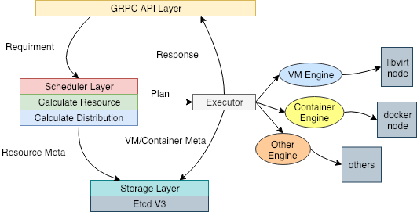

# Architecture

### 系统层面物理架构

>目标是做成可以横向扩展简高可用以及高性能的资源调度核心

物理层面来说，用户操作的 UI 和应用抽象都实现在 [citadel](https://github.com/projecteru2/citadel) 这个项目之中。它使用 gRPC 与 core 交互，从而把业务的一个个 App 部署到 Eru 的集群之中。

往下则是 Eru 核心组件 [core](https://github.com/projecteru2/core)。core 是无状态的编排调度核心，可以依据集群大小进行横向扩展。其职责是将 citadel 的容器操作进行编排并且按照一定的资源维度调度通过一定的算法计算出资源，编排好之后部署到到一个 Pod 中对应的一个或者多个 Nodes 上。core 之间的共享数据存储在 etcd 之中。

这里的 Pod 是一个逻辑概念，用于描述一组机器（Nodes）。每一个 Pod 都是由一组网络互通的 Node 构成。如果在大二层的层面上可以做到多机房互通的话，Pod 是允许旗下的 Node 也是跨机房的，从而在逻辑层面抹平机房这个概念。

在每一个 Node 上，均包含了至少2个必要的组件:

- [Docker](https://www.docker.com/)
- [agent](https://github.com/projecteru2/agent)

其中 agent 是 eru 二元结构中负责在 Node 上监控容器，将日志流打上必要的元信息进行转发，以及 metrics 的收集。

在我们的实际用况中，我们使用了 [rsyslog](http://www.rsyslog.com/) 作为 Node 上日志收集器，并转发到远端。同时通过 [moosefs](https://moosefs.com/index.html) 来实现容器间的文件共享。

### 业务层面

>目标是提供统一的离线在线应用开发流程

逻辑层面上，我们将每个业务逻辑都抽象成一个个 App，由 citadel 来管理，并与 gitlab/github 进行了整合，允许进行版本的跟踪。同时，操作 App 的一切工具如日志，如流量管理均在 citadel 上进行。总的来说一切 App 生命周期都由 citadel 管控着。

流量流动上面，可以看到外部世界与 App 的交互均需要通过 [elb](https://github.com/projecteru2/elb3)，elb 负责所有 7 层 App 的流量导入，并可以通过不同的 version/entrypoint/url 的组合将流量分流，打入到同一个 App 的某一组不同入口的容器里面。

### App

>抽象出一个或者多个具体的业务，通过不同的入口来区分其功能

应用本身可以是一个或者多个入口( entrypoint )，每一个入口都代表着功能不同（但代码是一份）的服务。要注意的是 Build 段的描述，通过这段描述 Eru 会找到对应的 Base image，在此之上构建出这个 App 不同版本的镜像。

在实际部署之前，应用用户还可以指定运行时 ENV 来满足配置和代码分离管理的需求，我们推荐一切配置均从 ENV 来负责获取。一旦容器启动完毕，运行中就再也不能改变 ENV 了，只能在 citadel 中修改之后等待下一次的上线操作，ENV 才会 apply 进新的容器的运行时。所以 ENV 是静态绑定的，无法进行动态绑定。

镜像构建完成后，应用开发者就可以选定入口，提出资源邀约，在 citadel 上进行部署了。如果有对外暴露需要也仅需增加 elb 的描述段，elb 会在每次同一 entrypoint 的容器上/下线的时候进行动态更新路由表，实现 zero downtime 的流量切换。

### 其他组件

- [spike](https://github.com/projecteru2/spike)
- [elb3](https://github.com/projecteru2/elb3)
- [footstone](https://github.com/projecteru2/footstone)

### 第三方支持

- [Calico](https://www.projectcalico.org/)
- [Macvlan](https://docs.oracle.com/cd/E37670_01/E37355/html/ol_mcvnbr_lxc.html)
- [openresty](https://openresty.org/en/)

