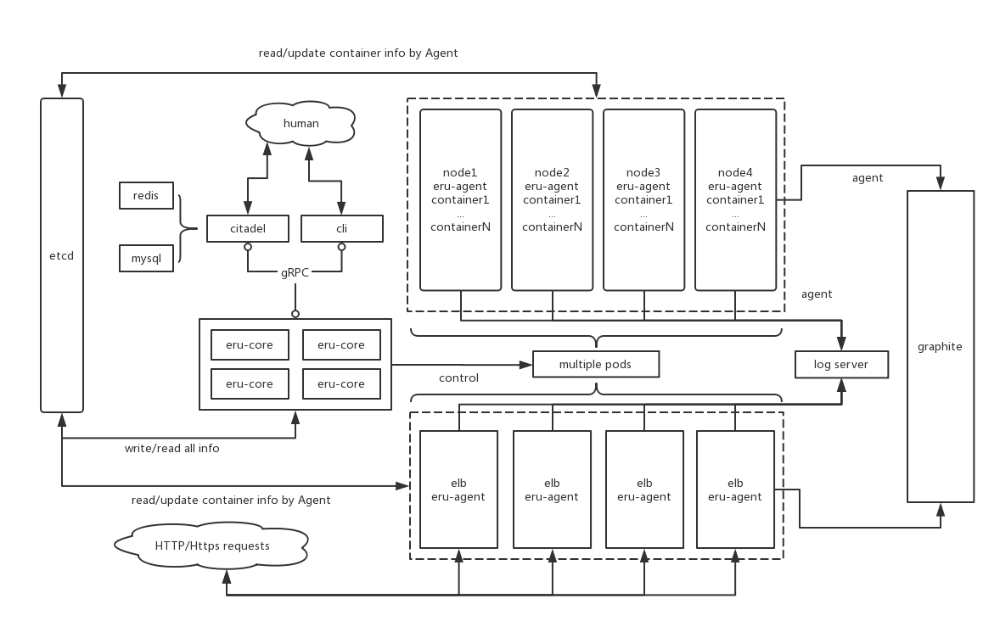

HelloWorld
==========

在运行了 [projecteru2/quickstart](https://github.com/projecteru2/quickstart/) 的 `quickstart.sh` 后，我们在一台机器上部署了：

1. docker with TLS
2. standalone etcd
3. core
4. agent

在逻辑上，我们增加了一个叫 `eru` 的 pod，并把运行 quickstart 脚本的机器加入到了这个 pod 中。在脚本中我们假定了这个 node 拥有 2个 CPU，每个 CPU 分成了 100 份计算资源，并且拥有 512M 的内存资源。

为了方便观察到资源的调度，这个 `eru` pod 我们设置为了 `CPU` 优先。因此这是 `lambda.sh` 中我们可以通过 --cpu 0.01 这样来限制运行容器的资源。因为每个 CPU 都分成了 100 份计算资源，所以 0.01 意味着最低保证有 1% 的 CPU 资源。

现在你能在这台机器上使用 `erucli` 命令（通过 docker run 执行）来操作这个单机 Eru 了。

## 老师能不能再给力点

我们来看看一个典型的 Eru 体系是怎样的，如下图：

我们可以看到，一个 Eru 集群是由一组 eru-core 控制多个 pod，每个 pod 中有多个 node，通过这些 node 来部署目标容器。外部流量可以通过 elb 导入到集群中，也可以通过其他的方式。操作人员只需要关注 citadel 或者 cli 就好了。那么我们在 Quickstart 的基础上，如何部署一个真实的集群呢？

### etcd

首先，我们要让 etcd 独立化。对于 Eru 而言，etcd 是完全独立的基础服务，承当着类似于 MySQL 的角色。因此你需要一个生产环境能使用的 Etcd 服务，并把 core、agent 以及每个 node 上的 docker 初始化的时候均指向它。这里你可以参考官方的部署[文档](https://github.com/coreos/etcd/blob/master/Documentation/dev-guide/local_cluster.md)。

### docker

我们需要在任意机器上初始化 docker，将 cluster-store 指向我们准备好的 etcd。为了安全推荐配置好 tls，可以参考[docker.sh](https://github.com/projecteru2/quickstart/blob/master/docker.sh)。

### eru-core

现在我们需要找一个地方运行一个或者一组 eru-core。对于高可用的系统而言，我们建议跑多个 eru-core 并在之上通过 LVS/haproxy 的组件来保证起服务高可用。

### eru-agent

在 eru-core 部署完之后，我们就可以通过 cli 在每个 pod 的每个 node 上增加 eru-agent 了。当然你也可以使用 docker 原生命令部署 agent 的[镜像](https://hub.docker.com/r/projecteru2/agent)。

### (可选) calico

在我们自己用的集群中是使用 Calico 作为 SDN provider 的，如果你也需要用可以参考[calico.sh](https://github.com/projecteru2/quickstart/blob/master/calico.sh)。要注意的是，倒数第二行的 docker network create 只需要在任意节点运行一次即可，并不需要运行多次。只要运行了一次之后，整个同一 etcd 作 cluster-storage 的 docker 都会知道有了这么一个网络。

### (可选) metrics and logs

在测试的时候可以使用 nc 来模拟 tcp 服务，在正式生产中当然就得用各自的生产 metrics 和 logs 服务了。

现在，ENJOY run container by Eru 吧！
